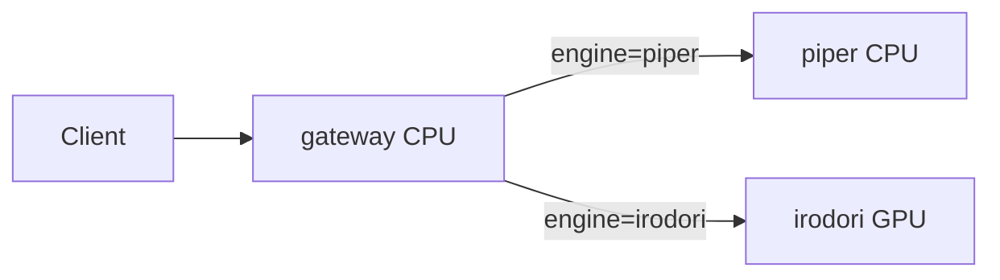

# tts_engine

Piper-plus（CPU）と Irodori-TTS v2（GPU）を切り替え可能な統合 TTS REST API です。Cloud Run 向けにゲートウェイ + バックエンド 2 サービス構成でデプロイします。

## アーキテクチャ



| サービス | 役割 |
|---------|------|
| `tts-gateway` | 公開 API・認証・ルーティング |
| `tts-piper` | [piper-plus](https://github.com/ayutaz/piper-plus) ONNX 推論 |
| `tts-irodori` | [Irodori-TTS v2](https://github.com/Aratako/Irodori-TTS/tree/v2) 推論 |

## ローカル起動

### 前提

- Docker / Docker Compose
- （Irodori 利用時）NVIDIA GPU + [NVIDIA Container Toolkit](https://docs.nvidia.com/datacenter/cloud-native/container-toolkit/install-guide.html)

### Piper のみ（CPU）

```bash
cp .env.example .env
docker compose up --build
```

ゲートウェイ: http://localhost:8080

### 全サービス（GPU プロファイル）

```bash
docker compose --profile gpu up --build
```

初回は Piper / Irodori のモデルダウンロードで起動に時間がかかります。

### スモークテスト

```bash
chmod +x scripts/smoke_test.sh scripts/download_models.sh
./scripts/smoke_test.sh
```

## API

### `GET /health`

ゲートウェイと下流サービスの状態（`degraded` 可）。

### `GET /v1/engines`

利用可能エンジン一覧。

### `POST /v1/tts/synthesize`（JSON）

**Piper**

```bash
curl -X POST http://localhost:8080/v1/tts/synthesize \
  -H "Content-Type: application/json" \
  -d '{"text":"こんにちは。","engine":"piper"}' \
  --output out.wav
```

**Irodori VoiceDesign**

```bash
curl -X POST http://localhost:8080/v1/tts/synthesize \
  -H "Content-Type: application/json" \
  -d '{
    "text": "今日はいい天気ですね。",
    "engine": "irodori",
    "irodori": {
      "irodori_variant": "voice_design",
      "caption": "落ち着いた女性の声で、近い距離感でやわらかく自然に読み上げてください。",
      "no_ref": true
    }
  }' \
  --output out.wav
```

### `POST /v1/tts/synthesize/multipart`（参照音声クローン）

```bash
curl -X POST http://localhost:8080/v1/tts/synthesize/multipart \
  -F "text=今日はいい天気ですね。" \
  -F "engine=irodori" \
  -F "irodori_variant=base" \
  -F "ref_audio=@reference.wav" \
  --output clone.wav
```

### 認証（任意）

本番では API キーを **Secret Manager**（`tts-api-keys`）に保存し、`Authorization: Bearer <key>` を付与します。手順は [`docs/SECURITY.md`](docs/SECURITY.md) を参照してください。

## 開発（uv）

```bash
curl -LsSf https://astral.sh/uv/install.sh | sh
./scripts/setup_vendor.sh   # vendor/Irodori-TTS（初回のみ）
uv sync --all-packages --dev
uv run --package tts-common pytest packages/tts_common/tests -q
```

個別起動:

```bash
uv run --package tts-piper-service python -m piper_service
uv run --package tts-gateway python -m gateway
```

## CI/CD（GitHub → 自動デプロイ）

[harness-engineering-template](https://github.com/t-hashiguchi1995/harness-engineering-template) と同じ **WIF シークレット名**（`WIF_PROVIDER` / `WIF_SA_DEPLOY` 等）で `main` push 時に自動デプロイします。

1. `./scripts/create-tfstate-bucket.sh` で GCS 状態バケット作成
2. [`terraform/bootstrap`](terraform/bootstrap/) で WIF 作成 → `./scripts/register-github-secrets.sh`
3. GCP 側の追加設定（GPU クォータ・HF Secret 等）— [`docs/CICD.md`](docs/CICD.md) の「追加設定」参照
4. `main` に push

| ワークフロー | 内容 |
|-------------|------|
| `ci.yml` | テスト |
| `terraform-validate.yml` | fmt / validate（`ENABLE_TERRAFORM_PLAN=true` で plan） |
| `deploy.yml` | Cloud Build + `terraform apply` |

詳細: [`docs/infrastructure.md`](docs/infrastructure.md) · [`docs/CICD.md`](docs/CICD.md)

## Cloud Run デプロイ（Terraform）

インフラは [`terraform/`](terraform/) で管理します（Artifact Registry、ゲートウェイ・Piper・Irodori、IAM）。

### 手動デプロイ

```bash
cd terraform
cp terraform.tfvars.example terraform.tfvars
terraform init -backend-config="bucket=YOUR_TFSTATE_BUCKET" -backend-config="prefix=tts-engine"
terraform apply
```

詳細: [`terraform/README.md`](terraform/README.md) · [`docs/CICD.md`](docs/CICD.md)

### Cloud Run リソース（Terraform 既定）

| サービス | CPU | メモリ | GPU | Ingress |
|---------|-----|--------|-----|---------|
| gateway | 1 | 1Gi | — | 公開 |
| piper | 2 | 4Gi | — | 内部のみ |
| irodori | 8 | 32Gi | **NVIDIA L4** ×1 | 内部のみ |

**Irodori** は 500M モデル + DACVAE 向けに **L4（24GB VRAM）・8 vCPU・32GiB・bf16・min_instances=1** を既定にしています。

- ゲートウェイ SA が Piper / Irodori を `roles/run.invoker` で呼び出し（`INTERNAL_USE_IAM=true`）
- Irodori は CPU スロットリング無効 + 起動時 CPU ブースト

### Piper モデルをイメージに同梱

```bash
PIPER_MODELS_DIR=./models/piper ./scripts/download_models.sh
# Dockerfile.piper に COPY models/piper /models/piper を追加するか、GCS から起動時取得
```

## 環境変数

| 変数 | サービス | 説明 |
|------|---------|------|
| `PIPER_SERVICE_URL` | gateway | Piper 内部 URL |
| `IRODORI_SERVICE_URL` | gateway | Irodori 内部 URL |
| `INTERNAL_USE_IAM` | gateway | Cloud Run 間 ID トークン認証 |
| `API_KEYS` | gateway | カンマ区切り API キー |
| `PIPER_MODEL` | piper | 既定音声モデル名 |
| `PIPER_DOWNLOAD_ON_START` | piper | 起動時 HF から取得 |
| `IRODORI_BASE_HF_REPO` | irodori | ベース HF リポ |
| `IRODORI_VOICE_DESIGN_HF_REPO` | irodori | VoiceDesign HF リポ |
| `IRODORI_MODEL_DEVICE` | irodori | `cuda` / `cpu` |

## ライセンス

- 本リポジトリのコード: MIT（各 `pyproject.toml` 参照）
- **モデル重み**: [piper-plus モデル](https://huggingface.co/ayousanz) および [Irodori モデルカード](https://huggingface.co/Aratako/Irodori-TTS-500M-v2) のライセンスに従ってください
